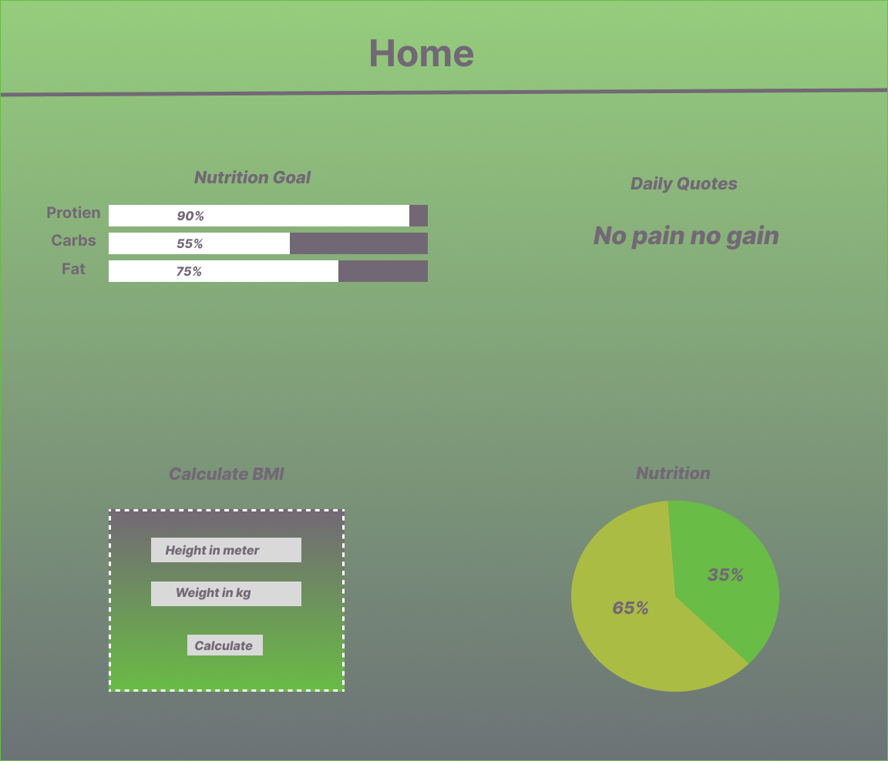
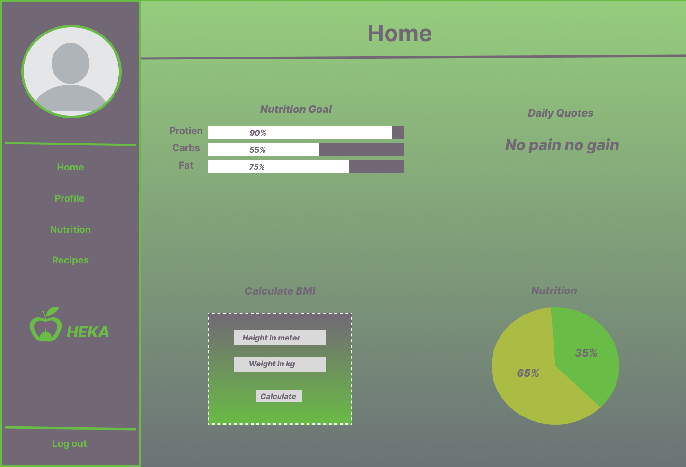
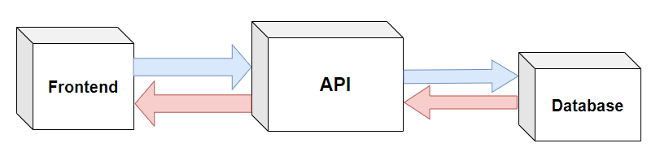
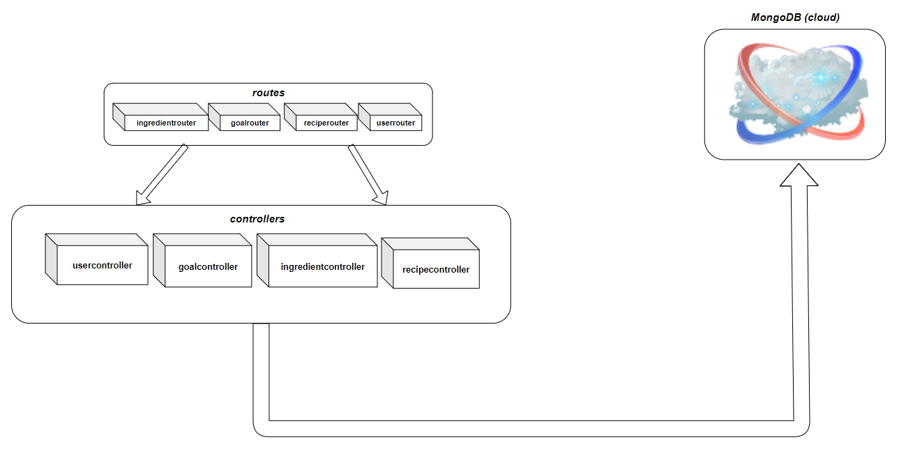
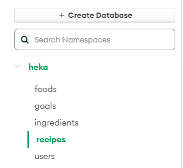
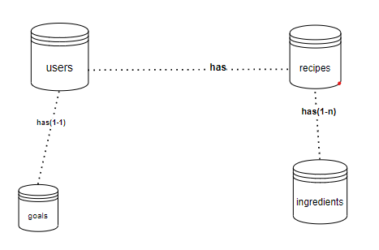
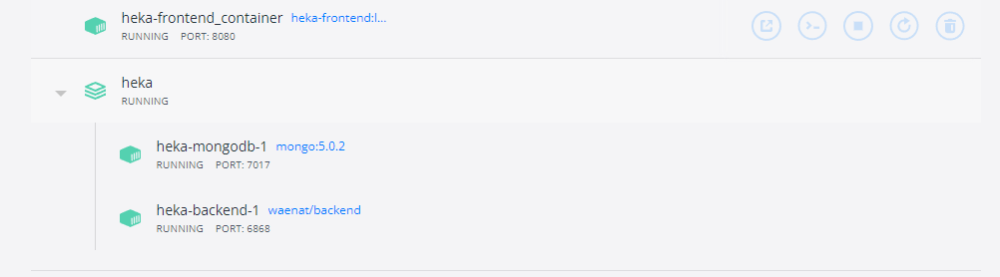

# Heka Documentation

> ## *WireFrame*
>  ### *Figma design*
>  
> 
>  *Navbar heka figma design*
>
> 
> 
>  *Home page heka figma design*
>
> 
> 
>  *Heka prototype figma design*

> ## *API*
> The API serves and handles all HTTP requests from the frontend. GET, POST, PUT and DELETE requests are handled on the API. The API serves as an interface to access the used cloud database (MongoDB).
>
> 
> 
> *API Interface - Backend*
> ### *Routes*
>  *Below are the exposed API routes*;
> | Routes(Endpoint)            | Description           | Method | Request data |
> |-----------------------------|-----------------------|--------|--------------|
> | /heka/api/users/register    | Add new user          | POST   | {email, name, password, age, sex, height, weight, photo} |
> | /heka/api/users/login       | Login                 | POST   | {email, password}                                        |
> | /heka/api/users/edit        | Edit user info        | PUT    | {email, name, password, age, sex, height, weight, photo} |
> | /heka/api/users/delete      | Delete user document  | DELETE | {email}     
> | /heka/api/recipes/add       | Add new recipe              | POST   | {owner, name, img, public, ingredients}
> | /heka/api/recipes/deleteOne | Delete one recipe by name   | DELETE | {name}
> | /heka/api/recipes/deleteAll | Delete all a user's recipes | DELETE | {owner}
> | /heka/api/recipes/private/:email |  Get all private the user's recipes | GET | {params: email}
> | /heka/api/recipes/public    | Get public recipes          | GET |
> | /heka/api/recipes/:name     | Get a recipe by its name    | GET | {params: name}
> | /heka/api/ingredients/              | Search for ingredients         | GET | {query: search}                                           
> | /heka/api/ingredients/grains        | Get grains like ingredients    | GET |                                             
> | /heka/api/ingredients/meat          | Get meat like ingredients      | GET |                                             
> | /heka/api/ingredients/vegetables    | Get vegetable like ingredients | GET |                                             
> | /heka/api/ingredients/fruits        | Get fruit like ingredients     | GET |                                             
> | /heka/api/ingredients/drinks        | Get drinks like ingredients    | GET |                                             
> | /heka/api/ingredients/diary         | Get diary like ingredients     | GET |                                             
> | /heka/api/ingredients/miscellaneous | Get miscellaneous ingredients  | GET |                                             
> | /heka/api/ingredients/add           | Add new ingredient             | GET | {name, id, amount, possibleUnits, nutrients, caloricBreakdown, categories}                                           
> | /heka/api/ingredients/:id           | Get an ingredient              | GET | {params: id}       
> | /heka/api/goals/addgoal             | Add goal                       | POST | {owner, category, protein}
> | /heka/api/goals/updategoal          | Update user's goal             | PUT  | {owner, category, protein}
> | /heka/api/goals/getgoal             | Get user's goal                | GET  | {owner}
>
> ### *Controllers*
> All database document(object) data manipulation regarding a recieved request is handled in their respective controller. The controllers handle getting, editing, object data functions and other provided CRUD opertions which are exposed via their respective routes ['**/users/login**', '**/recipes/add**', ... ]
> 
> 
>
> *Controller and route packages*
>
> ### *Data collection (DB)*
> MongoDB was used for data collection, we chose mongoDB on the basis that it is a cloud database, good documentation and active online community. Each entity/row is represented by a document in a collection in mongoDB. Each document is directly mapped to an individual object.
> 
> 
> 
>  *MongoDB heka database collections*
>
>  
>
> *Database collections*

> ## *Technologies*
> The following languages, frameworks were used:
> | Tech       | Where     |
> |------------|-----------|
> | Javascript | Frontend & backend   |
> | React.js   | Frontend             |
> | HTML & CSS | Frontend             |
> | Node and Express JS | Backend     |
> | MongoDB    | Backend (Database)   |
> | Figma      | Frontend (wireframe) |
> | Docker     | Frontend & backend   |
> | Heroku     | Frontend & backend   |

> ## *Project dependencies*
> | Dependencies                                      | Use |
> |---------------------------------------------------|-----|
> | [Nodemon](https://www.npmjs.com/package/nodemon)  | Auto restarting dev server
> | [Express](https://www.npmjs.com/package/express)  | API
> | [bcrypt](https://www.npmjs.com/package/bcrypt)    | Encrypting and validating passwords.
> | [cors](https://www.npmjs.com/package/cors)        | cors option
> | [jsonWebToken](https://www.npmjs.com/package/jsonwebtoken) | Security
> | [dotenv](https://www.npmjs.com/package/dotenv)             | environment variables, tokens.
> | [mongoose](https://www.npmjs.com/package/mongoose)         | Cloud database
> | [side-channel](https://www.npmjs.com/package/side-channel) |
> | [raw-body](https://www.npmjs.com/package/raw-body)         |
> | [antd](https://www.npmjs.com/package/antd)                 |
> | [react](https://www.npmjs.com/package/react)               |
> | [react-dom](https://www.npmjs.com/package/react-dom)       |
> | [axios](https://www.npmjs.com/package/axios)               | HTTP requests

> ## *Deployment*
> Both the frontend and backend packages have been deployed seperately on heroku with their respective docker images, URL:
> ### Heroku
> |URL                                                              |Point           |
> |-----------------------------------------------------------------|----------------|
> |[Heka-Client-side](https://heka-nutrition.herokuapp.com/)        |Heka-Client-side|       
> |[Heka-Server-side](https://boiling-wave-51445.herokuapp.com/test)|Heka-Server-side|
> 

> ## *Dockerize*
> 
> 
>  *Docker running containers for front-end and back-end*
>  
> ### *Heka-Client-side docker image*
> docker pull waenat/heka-frontend:hekafrontend
> ### *Heka-Server-side docker image*
> docker-compose pull
> Should be used with respective docker-compose.yml and .evn file

## *Contributors*
* [Stiv Abdullwahed](https://github.com/StivHKR)
* [Wael NataFji](https://github.com/wael-nt)
* [Sam Mcmurray ](https://github.com/sam-mcmurray)
* [Wills Ekanem](https://github.com/Willz01)
