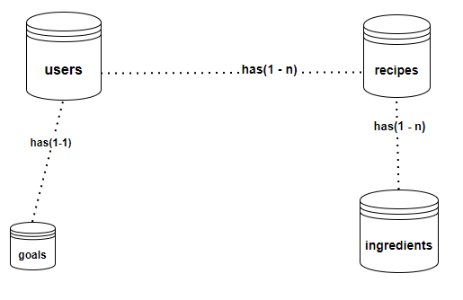

# Heka Documentation

> ## WireFrame

> ## API
> The API serves and handles HTTP requests. GET, POST, PUT an DELETE request are handled on the API. The API > serves as an interface to access the used cloud database (MongoDB)
> #### Routes
> | Routes                      | Description           | Method | Request data |
> |-----------------------------|-----------------------|--------|--------------|
> | /heka/api/users/register    | Add new user          | POST   | {email, name, password, age, sex, height, weight, photo} |
> | /heka/api/users/login       | Login                 | POST   | {email, password}                                        |
> | /heka/api/users/edit        | Edit user info        | PUT    | {email, name, password, age, sex, height, weight, photo} |
> | /heka/api/users/delete      | Delete user document  | DELETE | {email}     
> | /heka/api/recipes/add       | Add new recipe              | POST   | {owner, name, img, public, ingredients}
> | /heka/api/recipes/deleteOne | Delete one recipe by name   | DELETE | {name}
> | /heka/api/recipes/deleteAll | Delete all a user's recipes | DELETE | {owner}
> | /heka/api/recipes/private/:email |  Get all private the user's recipes | GET | {params: email}
> | /heka/api/recipes/public    | Get public recipes          | GET |
> | /heka/api/recipes/:name     | Get a recipe by its name    | GET | {params: name}
> | /heka/api/ingredients/              | Search for ingredients         | GET | {query: search}                                           
> | /heka/api/ingredients/grains        | Get grains like ingredients    | GET |                                             
> | /heka/api/ingredients/meat          | Get meat like ingredients      | GET |                                             
> | /heka/api/ingredients/vegetables    | Get vegetable like ingredients | GET |                                             
> | /heka/api/ingredients/fruits        | Get fruit like ingredients     | GET |                                             
> | /heka/api/ingredients/drinks        | Get drinks like ingredients    | GET |                                             
> | /heka/api/ingredients/diary         | Get diary like ingredients     | GET |                                             
> | /heka/api/ingredients/miscellaneous | Get miscellaneous ingredients  | GET |                                             
> | /heka/api/ingredients/add           | Add new ingredient             | GET | {name, id, amount, possibleUnits, nutrients, caloricBreakdown, categories}                                           
> | /heka/api/ingredients/:id           | Get an ingredient              | GET | {params: id}       
> | /heka/api/goals/addgoal             | Add goal                       | POST | {owner, category, protein}
> | /heka/api/goals/updategoal          | Update user's goal             | PUT  | {owner, category, protein}
> | /heka/api/goals/getgoal             | Get user's goal                | GET  | {owner}

> #### Data collection (DB)
> MongoDB was used for data collection, we chose mongoDB on the basis that it is a cloud database. Each entity/row is represented by a document in a collection in mongoDB. Each document is directly mapped to an individual object.
> 
>   
>  

> ## Technologies
> The following languages, frameworks were used:
> | Tech       | Where     |
> |------------|-----------|
> | Javascript | Frontend & backend   |
> | React.js   | Frontend             |
> | HTML & CSS | Frontend             |
> | Node and Express JS | Backend     |
> | MongoDB    | Backend (Database)   |
> | Figma      | Frontend (wireframe) |

> ## Project dependencies
> | Dependencies                                      |
> |---------------------------------------------------|
> | [Nodemon](https://www.npmjs.com/package/nodemon)  |
> | [Express](https://www.npmjs.com/package/express)  |
> | [bcrypt](https://www.npmjs.com/package/bcrypt)    |
> | [cors](https://www.npmjs.com/package/cors)        |
> | [jsonWebToken](https://www.npmjs.com/package/jsonwebtoken) |
> | [dotenv](https://www.npmjs.com/package/dotenv)             |
> | [mongoose](https://www.npmjs.com/package/mongoose)         |
> | [side-channel](https://www.npmjs.com/package/side-channel) |
> | [raw-body](https://www.npmjs.com/package/raw-body)         |
> | [antd](https://www.npmjs.com/package/antd)                 |
> | [react](https://www.npmjs.com/package/react)               |
> | [react-dom](https://www.npmjs.com/package/react-dom)       |
> | [axios](https://www.npmjs.com/package/axios)               |

> ## Deployment
> Both the frontend and backend packages have been deployed seperately on heroku with their respective docker images, URL:
> 
> | Point       | URL    |
> |-------------|--------|
> |
> 

## Members
* [Stiv Abdullwahed](https://github.com/StivHKR)
* [Wael NataFji](https://github.com/wael-nt)
* [Sam Mcmurray ](https://github.com/sam-mcmurray)
* [Wills Ekanem](https://github.com/Willz01)